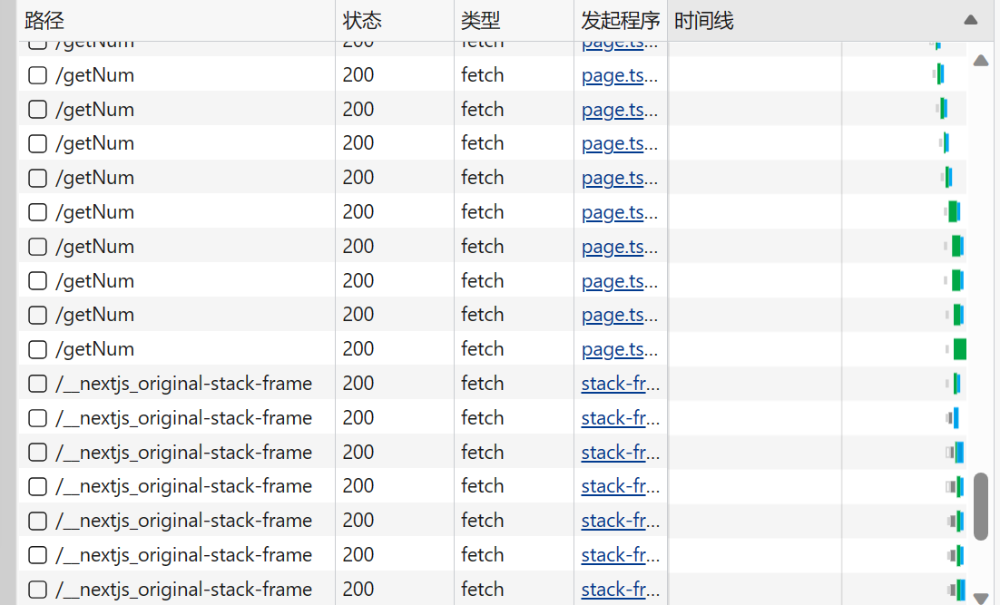

# 版本说明
基于next.js 14 app目录模式和 typescript 5.2以上版本
# 组件类型
next.js中组件分为客户端组件和服务端组件,两者的名称不能完全反应它们的渲染时机  
## 服务端组件
服务端组件不能拥有状态,*总是在服务端完成全部的生命周期*,即使它依赖的函数是异步的,也会在服务端等待执行它们完毕  
服务端组件可以是一个异步函数   
服务端不可以使用`context`、`router`等相关内容(但可以使用createServerContext形成服务端的上下文)
## 客户端组件
客户端组件可以拥有状态,仅在服务端完成组件函数的*第一次执行*,而`useEffect`的内容在客户端执行   
客户端组件需要在文件最开始使用`'use client'`声明 这个声明仅对单个文件有效   
客户端组件必须是同步函数
## 关于客户端组件
服务端组件可以自由引用客户端组件  
客户端组件Layout下的页面也可以是服务端组件   
但客户端组件直接引用的子组件*必须*是客户端组件  
也不能用`use`钩子(无论是否发起网络请求)   
否则会发生很可怕的事情  
  
这一点很重要 因为next*不会*提示你 也没有任何约束 只有报错
# 服务端数据支持
这些函数/数据仅在服务端运行或生成
## 元数据
*仅服务端组件可用*
静态导出元数据  
``` ts
import type { Metadata } from "next";

export const metadata: Metadata = {
    'title': 'test'
}
```
动态生成元数据   
``` ts
import type { Metadata,ResolvingMetadata } from "next";
type Props = {
  searchParams: {
    title?:string
  }
}

export function generateMetadata(props:Props):Metadata{
    return {
        title:props.params.id??'title'
    }
}

//异步函数生成元数据也是可行的
export async function generateMetadata(props:Props,parent: ResolvingMetadata):Promise<Metadata>{
    return {
        title:props.params.id??(await parent).title??'title'
    }
}
```
## `fetch`
next.js在*服务端*提供了特制的fetch  
它的第二个参数可以有一个属性`next` 用来设置资源失效时间   
``` ts
fetch(url,{
    next:{
        { 
            revalidate: 5000//每5000毫秒缓存失效一次
        }
    }
})
```
## 异步函数
服务端组件可以直接通过异步函数获取数据  
``` ts
async function getData(){
    await new Promise(resolve=>setTimeout(resolve,2000))
    return 'data'
}
 
export default async function Test(){
    const data = await getData()
    return <div>{data}</div>
}
```
## useEffect
`useEffect`在客户端执行副作用函数
``` ts
'use client'

import { use,useState,useEffect } from 'react'

async function getData(text:string){
    return text
}

export default function Test(){
    const [text,setText] = useState('use')
    useEffect(()=>{
        getData('useEffect').then(text=>setText(text))
    },[])
    return <button onClick={()=>setText('click')}>{text}</button>
}
```
尽管看上去`useEffect`调用了服务端的函数,实际上只是调用了副本  
