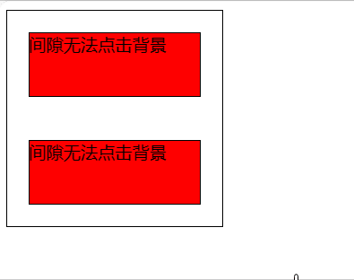

# 问题
一组浮动在地图上的按钮 需要透过按钮的间隙点击地图<br>
实际上 点击按钮间隙时 会被按钮组容器遮挡 无法下方内容<br>


# 解决
把容器的overflow设置为visible并设置其宽/高为0<br>
这样的话按钮的间隙就不再是容器内容 而是背景的内容<br>
```css
.container{
    position: absolute;
    width: 200px;
    height: 200px;
    display:flex;
    flex-direction: column;
}
.can-click{
    overflow: visible;
    height: 0;
}
```
`.container.can-click`可实现需求<br>

<br>

示例在`index.html`
# 说明
1.容器退化为线后 子元素需要自行指定宽高 或依靠内容撑起盒子<br>

2.容器高度设为0后 子元素在竖直方向上会尽可能收缩 宽度/水平方向同理。<br>
    因此如果有在某个方向上自然展开的需求，就应该设置对应的属性为auto 另一个设为0<br>