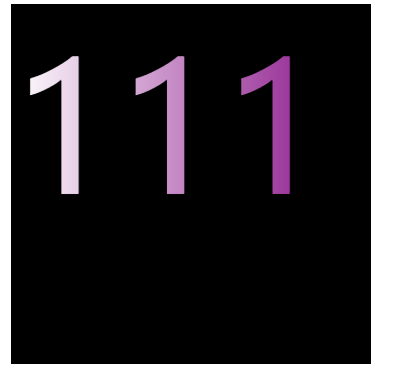
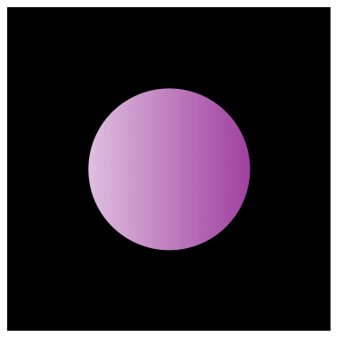

# 问题
用文字或指定的图案裁剪图片,或制造镂空
# 解决
## 1.文字裁剪
``` css
.clip {
    background-clip:text;
    -webkit-background-clip:text;
    color:transparent;
}
```
效果:  


## 2.图形裁剪
``` css
.clip1 {
    /**简单图形 */
    clip-path:circle(50px);
}
```
``` css
.clip2{
    /**复杂图形 */
    mask-image:url("clip.svg")
}
```
效果:  

## 3.镂空
CSS没有直接提供镂空功能，但可以转化为裁剪间接实现  
# 说明
此处没有列举属性也可实现裁剪功能,例如mix-blend-mode、mask-mode 和 box-shadow，但复杂度和正规程度略逊。